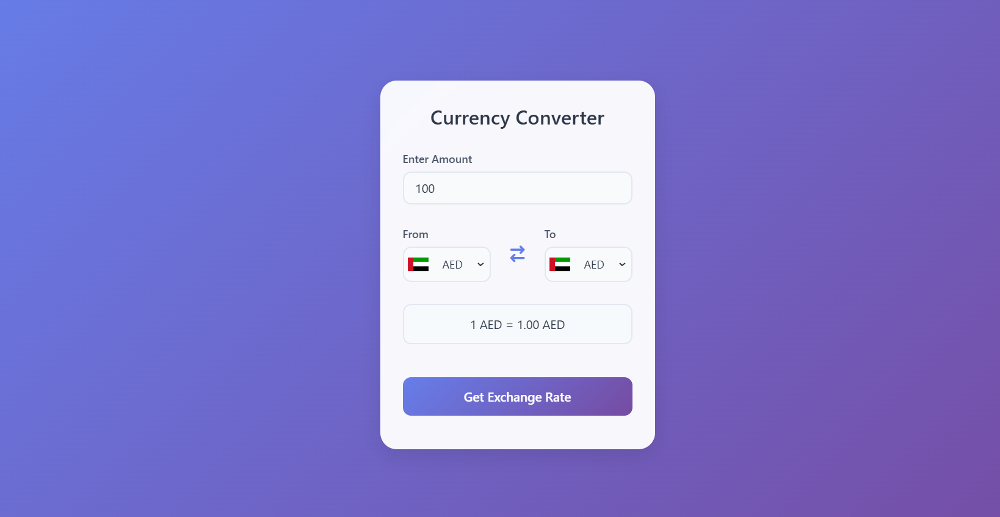
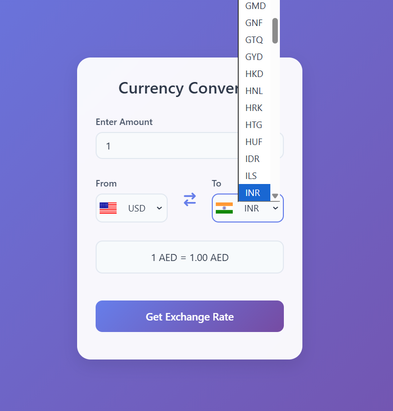
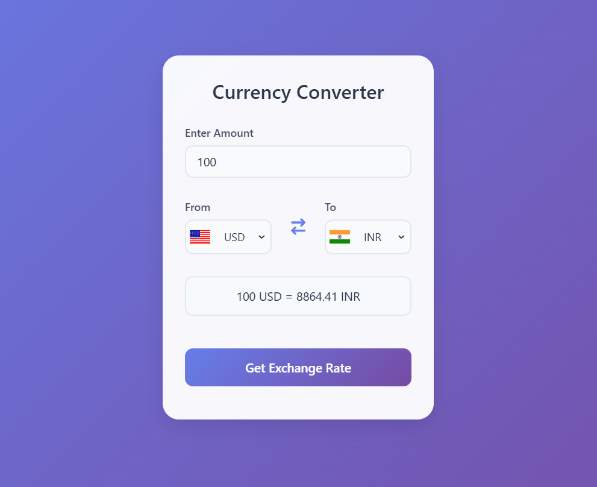

# 💱 Currency Converter

A sleek and modern currency converter web application built with HTML, CSS, and JavaScript. This application allows users to convert between different currencies in real-time using up-to-date exchange rates.

<!--  -->

## ✨ Features

- **Real-time Currency Conversion**: Get live exchange rates for currencies worldwide
- **Interactive UI**: Modern and responsive design with smooth animations
- **Flag Visualization**: Display country flags for easy currency identification
- **Multiple Currency Support**: Support for over 150 different currencies
- **User-friendly Interface**: Clean and intuitive design for seamless user experience

## 🚀 Live Demo

[View Live Demo](https://know-currency-values.vercel.app/) <!-- Replace with your actual demo link -->

## 🛠️ Technologies Used

- HTML5
- CSS3
- JavaScript (ES6+)
- [Currency API](https://cdn.jsdelivr.net/npm/@fawazahmed0/currency-api) - For real-time exchange rates
- [FlagsAPI](https://flagsapi.com/) - For country flags
- Font Awesome - For icons

## 🎯 Key Features Explained

1. **Dynamic Currency Selection**
   - Dropdown menus with currency codes
   - Auto-updating country flags
   - Support for major world currencies

2. **Real-time Conversion**
   - Instant rate calculations
   - Up-to-date exchange rates
   - Clear display of conversion results

3. **Responsive Design**
   - Works on all devices
   - Smooth animations
   - Intuitive layout

## 💻 Local Development

1. Clone the repository:
   ```bash
   git clone https://github.com/your-username/currency-converter.git
   ```

2. Navigate to the project directory:
   ```bash
   cd currency-converter
   ```

3. Open `index.html` in your browser or use a local server:
   ```bash
   # Using Python
   python -m http.server 8000
   # or using Node.js
   npx http-server
   ```

## 📸 Screenshots

### Main Interface


### Currency Selection


### Conversion Result


## 🤝 Contributing

Contributions are welcome! Please feel free to submit a Pull Request.

1. Fork the repository
2. Create your feature branch (`git checkout -b feature/AmazingFeature`)
3. Commit your changes (`git commit -m 'Add some AmazingFeature'`)
4. Push to the branch (`git push origin feature/AmazingFeature`)
5. Open a Pull Request

## 📝 License

This project is licensed under the MIT License - see the [LICENSE](LICENSE) file for details.

## 🙏 Acknowledgments

- Currency rates provided by [Currency API](https://github.com/fawazahmed0/currency-api)
- Country flags provided by [FlagsAPI](https://flagsapi.com/)
- Icons by [Font Awesome](https://fontawesome.com/)

## 📞 Contact

Mohammed Saad - [@Mohammed Saad](https://www.linkedin.com/in/imohammedsaad/)

Project Link: [https://github.com/imohammedsaad/currency-converter](https://github.com/imohammedsaad/currency-converter)

---
⭐️ From [imohammedsaad](https://github.com/imohammedsaad)